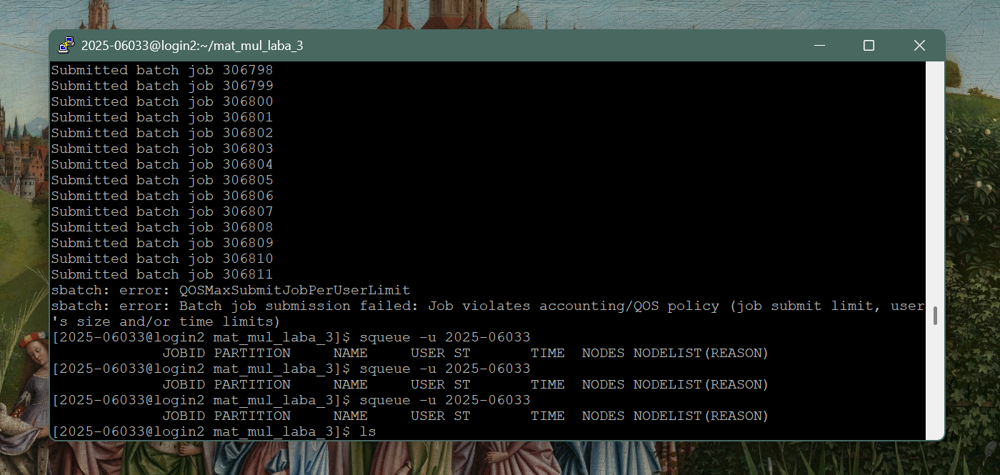
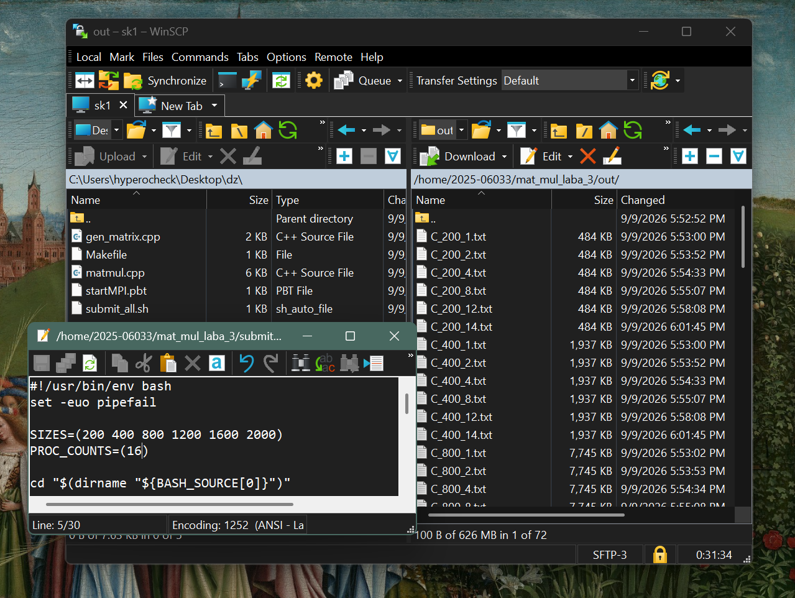
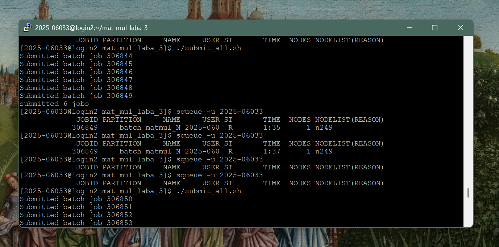

# Lab 3

## Task description

Модифицировать программу из л/р №1 для параллельной работы по технологии MPI.
Провести серию экспериментов с разными размерами матриц (примерно 200, 400,
800, 1200, 1600, 2000), с разным количеством вычислительных ядер (1, 2, 4, 8
и т.д.).

## Files

`matmul.cpp` - умножение матриц с MPI  
`gen_matrix.cpp` - генератор случайных матриц  
`Makefile` - сборка (mpicxx)  
`startMPI.pbt` - шаблон джобы SLURM, параметризуется переменными окружения N (размер матрицы) и PROCS (число процессов)  
`submit_all.sh` - ставит в очередь джобы по всем размерам для значений числа процессов, перечисленных в PROC_COUNTS  
`collect_results.py` - парсит вывод джоб в графики и статистику

## Build

```bash
module load intel/mpi4
./submit_all.sh                 
squeue -u 2025-06033               
# локльно на своей машине
python3 collect_results.py
```

Матрицы генерируются один раз для каждого размера `data/A_<N>.txt`,
`data/B_<N>.txt` до постановки в очередь.  
Результат `out/C_<N>_<P>.txt` и статистика `out/stats_<N>_<P>.txt` каждой джобы
пишутся в файлы. Каждая джоба также пишет одну строку вида
`RESULT n=<N> processes=<P> time=<seconds>` в свой лог файл
`results/logs/matmul_N<N>_P<P>_<jobid>.log`

## Description

Подключение к серверу происходило по ssh через PuTTY, файлы заливались на сервер через WinSCP.

Изначально скрипт `submit_all.sh` пытался поставить в очередь все комбинации сразу (6
размеров на все значения числа процессов). На практике это уперлось в лимит
очереди кластера в 16 задач на пользователя, дальнейшие вызовы `sbatch`
отклонялись политикой QOS.

Поэтому джобы ставились в очередь партиями - по одному значению числа процессов
за раз:

1. В `submit_all.sh` в массиве `PROC_COUNTS` оставлял одно значение (например `PROC_COUNTS=(16)`).
2. Запускал `./submit_all.sh`, который ставил в очередь 6 задач (по одному на каждый размер матрицы 200 .. 2000 для этого числа процессов).
3. Ждал, пока очередь опустеет `squeue -u 2025-06033`
4. Менял `PROC_COUNTS` на следующее значение и повторял.

Так последовательно прогнал `PROC_COUNTS` = [1, 2, 4, 8, 12, 14, 16]  


*Попытка поставить в очередь слишком много задач сразу*


*Файлы проекта и результаты на сервере, `submit_all.sh`
открыт для правки `PROC_COUNTS` перед очередным запуском*


*`./submit_all.sh` ставит очередную партию из 6 задач, `squeue -u <user>`
показывает выполняющуюся джобу; следующая партия запускается только после того,
как очередь опустела*

## Implementation

Программа взята из л/р №1 и распараллелена по строкам матрицы `A` между MPI-процессами:

1. Процесс `0` читает матрицы `A` и `B` из файлов, рассылает размер `n` всем процессам (`MPI_Bcast`).
2. Матрица `B` целиком рассылается всем процессам (`MPI_Bcast`) - каждой строке результата нужна вся `B`.
3. Матрица `A` делится по строкам и раздаётся процессам (`MPI_Scatterv`); строки распределяются максимально ровно, остаток (`n % size`) раздаётся первым процессам по одной дополнительной строке.
4. Каждый процесс независимо считает свой блок строк `C = A x B`
5. Результаты собираются обратно на процессе `0` (`MPI_Gatherv`), который пишет `C` и файл со статистикой.

Время исполнения замеряется `MPI_Wtime()` вокруг всего распределённого участка (`Bcast` B + `Scatterv` A + локальное умножение + `Gatherv` C). Итоговое время это максимум по всем процессам (`MPI_Reduce` с `MPI_MAX`), т.к. общее время работы определяется самым медленным процессом.

## Results

`GFLOPS` = 2·N^3 / `time` / 1e9  
`speedup` = `time(processes=1)` / `time(processes=N)` для того же `N`  
`efficiency` = `speedup` / `processes`  

| `N` | `processes` | `time, s` | `GFLOPS` | `speedup` | `efficiency` |
| - | - | - | - | - | - |
| 200 | 1 | 0.0103 | 1.55 | 1.00 | 1.00 |
| 200 | 2 | 0.0052 | 3.05 | 1.96 | 0.98 |
| 200 | 4 | 0.0033 | 4.86 | 3.13 | 0.78 |
| 200 | 8 | 0.0019 | 8.47 | 5.46 | 0.68 |
| 200 | 12 | 0.0018 | 9.13 | 5.88 | 0.49 |
| 200 | 14 | 0.0018 | 9.05 | 5.83 | 0.42 |
| 200 | 16 | 0.0019 | 8.50 | 5.47 | 0.34 |
| 400 | 1 | 0.0717 | 1.78 | 1.00 | 1.00 |
| 400 | 2 | 0.0374 | 3.42 | 1.92 | 0.96 |
| 400 | 4 | 0.0203 | 6.31 | 3.54 | 0.88 |
| 400 | 8 | 0.0122 | 10.49 | 5.88 | 0.73 |
| 400 | 12 | 0.0103 | 12.39 | 6.94 | 0.58 |
| 400 | 14 | 0.0092 | 13.89 | 7.78 | 0.56 |
| 400 | 16 | 0.0074 | 17.40 | 9.75 | 0.61 |
| 800 | 1 | 0.5474 | 1.87 | 1.00 | 1.00 |
| 800 | 2 | 0.2769 | 3.70 | 1.98 | 0.99 |
| 800 | 4 | 0.1505 | 6.81 | 3.64 | 0.91 |
| 800 | 8 | 0.1257 | 8.15 | 4.35 | 0.54 |
| 800 | 12 | 0.1255 | 8.16 | 4.36 | 0.36 |
| 800 | 14 | 0.0654 | 15.67 | 8.38 | 0.60 |
| 800 | 16 | 0.0613 | 16.69 | 8.92 | 0.56 |
| 1200 | 1 | 1.9734 | 1.75 | 1.00 | 1.00 |
| 1200 | 2 | 0.9683 | 3.57 | 2.04 | 1.02 |
| 1200 | 4 | 0.5746 | 6.01 | 3.43 | 0.86 |
| 1200 | 8 | 0.4204 | 8.22 | 4.69 | 0.59 |
| 1200 | 12 | 0.4061 | 8.51 | 4.86 | 0.40 |
| 1200 | 14 | 0.2022 | 17.10 | 9.76 | 0.70 |
| 1200 | 16 | 0.2003 | 17.25 | 9.85 | 0.62 |
| 1600 | 1 | 4.8234 | 1.70 | 1.00 | 1.00 |
| 1600 | 2 | 2.5204 | 3.25 | 1.91 | 0.96 |
| 1600 | 4 | 1.3332 | 6.14 | 3.62 | 0.90 |
| 1600 | 8 | 0.9788 | 8.37 | 4.93 | 0.62 |
| 1600 | 12 | 0.9466 | 8.65 | 5.10 | 0.42 |
| 1600 | 14 | 0.4654 | 17.60 | 10.36 | 0.74 |
| 1600 | 16 | 0.4606 | 17.79 | 10.47 | 0.65 |
| 2000 | 1 | 9.1726 | 1.74 | 1.00 | 1.00 |
| 2000 | 2 | 4.7156 | 3.39 | 1.95 | 0.97 |
| 2000 | 4 | 2.5712 | 6.22 | 3.57 | 0.89 |
| 2000 | 8 | 1.8906 | 8.46 | 4.85 | 0.61 |
| 2000 | 12 | 1.8569 | 8.62 | 4.94 | 0.41 |
| 2000 | 14 | 0.8756 | 18.27 | 10.48 | 0.75 |
| 2000 | 16 | 0.8775 | 18.23 | 10.45 | 0.65 |


## Summary

На всех размерах матрицы время выполнения монотонно падает с ростом числа
процессов, а вычислительная мощность кластера заметно выше, чем на
локальном ноутбуке.

`Speedup` и `efficiency` растут не строго монотонно с числом процессов - и это
видно на каждом размере матрицы одинаково стабильно, значит, это не шум
единичного замера, а системный эффект:

- До 4 процессов масштабирование почти линейное (`efficiency` 0.8-1.0).
- На 8 и 12 процессах `efficiency` заметно проседает (0.4-0.6), а время почти
  не меняется между 8 и 12 процессами (например, `N=1600`: 0.979 c против
  0.947 c).
- На 14 и 16 процессах время резко (почти вдвое) падает по сравнению с 8/12,
  `efficiency` снова подскакивает (0.6-0.75), при этом 14 и 16 процессов дают
  почти одинаковое время.

Коммуникационные расходы MPI (`Bcast` полной `B` каждому процессу,
`Scatterv`/`Gatherv` для `A`/`C`) сильнее всего заметны на маленьких `N`: при
`N=200` `efficiency` падает быстрее всего с ростом числа процессов (с 1.00 до
0.34), т.к. вычислительная часть `O(N^3)` там мала и не успевает
перекрыть накладные расходы на рассылку/сбор данных, тогда как на `N=2000`
падение более плавное.
