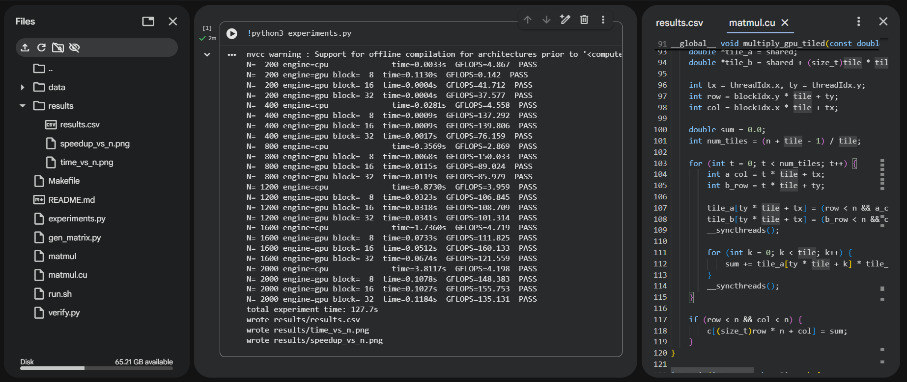
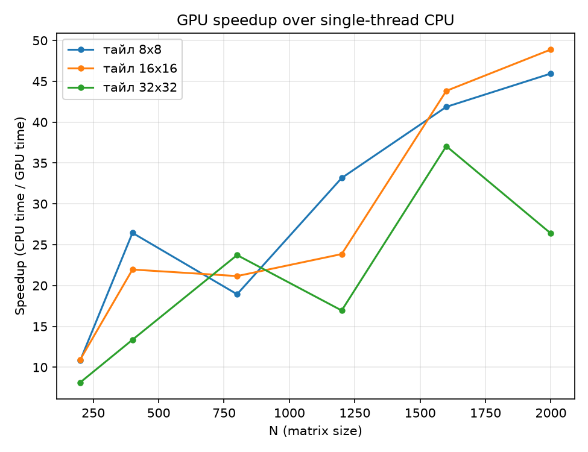

# Lab 4

## Task description

Модифицировать программу из л/р №1 для параллельной работы по технологии CUDA. Провести эксперименты с разными размерами матриц и различными конфигурациями сетки блоков.

## Files

`matmul.cu` - умножение матриц с CUDA 
`Makefile` - сборка (`nvcc`)  
`gen_matrix.py` - генерация случайных матриц  
`verify.py` - верификация результата через NumPy  
`experiments.py` - серия экспериментов (размеры x CPU/GPU x размер тайла) + графики  
`run.sh <n> [cpu|gpu] [tile]` - один запуск

## Device

Расчеты выполнялись в Google Colab на видеокарте **Tesla T4**



## Build

1. Поменять рантайм Colab на GPU
2. Загрузить в рабочую директорию файлы: `matmul.cu`, `Makefile`, `gen_matrix.py`, `verify.py` и `experiments.py`
3. Запустить блок с командой:

   ```bash
   !python3 experiments.py
   ```

   Команда соберет `matmul.cu` через `nvcc` (`make -s`), прогонит все эксперименты, проверит каждый результат через NumPy, запишет `results/results.csv`, `results/time_vs_n.png` и `results/speedup_vs_n.png`

Для одиночного запуска `./run.sh <n> gpu <tile>` или `./run.sh <n> cpu`.

## Description

Программа взята из лр 1 (`matmul.c`) и дополнена GPU-веткой на CUDA:

- **CPU** (`multiply_cpu`) - тот же однопоточный `i-k-j` цикл
- **GPU** (`multiply_gpu_tiled`) - тайловое умножение с разделяемой памятью: блок потоков размером `tile x tile` (`tile` = 8/16/32) поэтапно грузит по тайлу из матриц `A` и `B` в `__shared__` память, считает частичную сумму и сдвигается по `k`. Размер тайла передается в рантайме через динамическую разделяемую память `extern __shared__`, поэтому один и тот же бинарник гоняется с разными `tile` без пересборки. `N^2` независимых потоков (по одному на каждый элемент результата `C[row][col]`, координаты которого получаются из `threadIdx`+`blockIdx`), сгруппированных в блоки `tile x tile`; тайловая схема нужна, чтобы каждый элемент `A` и `B` читался из медленной глобальной памяти один раз на тайл (совместно всеми потоками блока), а не по разу на каждый поток, которому он нужен.


## Results

`GFLOPS` = 2*N^3 / `time` / 1e9  
`speedup` = `time(cpu)` / `time(gpu, tile)` для того же `N`  
`verify` = сравнение с NumPy (`A @ B`)

| `N` | `engine` | `time, s` | `GFLOPS` | `speedup` | `verify` |
| - | - | - | - | - | - |
| 200 | cpu | 0.003277 | 4.88 | 1.00 | PASS |
| 200 | gpu, tile=8 | 0.000303 | 52.76 | 10.82 | PASS |
| 200 | gpu, tile=16 | 0.000300 | 53.34 | 10.92 | PASS |
| 200 | gpu, tile=32 | 0.000403 | 39.69 | 8.13 | PASS |
| 400 | cpu | 0.026657 | 4.80 | 1.00 | PASS |
| 400 | gpu, tile=8 | 0.001008 | 127.02 | 26.45 | PASS |
| 400 | gpu, tile=16 | 0.001214 | 105.42 | 21.96 | PASS |
| 400 | gpu, tile=32 | 0.001995 | 64.15 | 13.36 | PASS |
| 800 | cpu | 0.208757 | 4.91 | 1.00 | PASS |
| 800 | gpu, tile=8 | 0.011027 | 92.86 | 18.93 | PASS |
| 800 | gpu, tile=16 | 0.009867 | 103.78 | 21.16 | PASS |
| 800 | gpu, tile=32 | 0.008798 | 116.40 | 23.73 | PASS |
| 1200 | cpu | 0.685520 | 5.04 | 1.00 | PASS |
| 1200 | gpu, tile=8 | 0.020669 | 167.21 | 33.17 | PASS |
| 1200 | gpu, tile=16 | 0.028741 | 120.25 | 23.85 | PASS |
| 1200 | gpu, tile=32 | 0.040458 | 85.42 | 16.94 | PASS |
| 1600 | cpu | 2.157083 | 3.80 | 1.00 | PASS |
| 1600 | gpu, tile=8 | 0.051513 | 159.03 | 41.87 | PASS |
| 1600 | gpu, tile=16 | 0.049212 | 166.46 | 43.83 | PASS |
| 1600 | gpu, tile=32 | 0.058200 | 140.76 | 37.06 | PASS |
| 2000 | cpu | 4.771697 | 3.35 | 1.00 | PASS |
| 2000 | gpu, tile=8 | 0.103834 | 154.09 | 45.96 | PASS |
| 2000 | gpu, tile=16 | 0.097584 | 163.96 | 48.90 | PASS |
| 2000 | gpu, tile=32 | 0.180960 | 88.42 | 26.37 | PASS |




## Summary

**GPU быстрее однопоточного CPU в 8-49 раз**, причем разрыв растет вместе с `N`: на `N=200` ускорение ~8-11x, на `N=2000` - уже 26-49x. CPU растет как `O(N^3)` (0.003с -> 4.8с), а GPU на маленьких `N` (200-400) не успевает загрузить все 2560 ядер работой (мало блоков), поэтому там ускорение GPU относительно CPU меньше, чем на больших `N`, где видеокарта уже работает "в полную силу".

**Тайл 32x32 - стабильно худший вариант**, почти на всех `N` он медленнее и 8x8, и 16x16 (на `N=2000` даже почти вдвое медленнее: 0.181с против 0.098-0.104с). Причина - на блок в 1024 потока нужно вдвое больше разделяемой памяти (2*32*32*8 = 16 КБ), чем на 16x16, из-за чего на одном SM одновременно помещается меньше блоков. Тайлы 8x8 и 16x16 идут почти вровень и по очереди оказываются лучшими на разных `N` (16x16 - на 200/800/1600/2000, 8x8 - на 400/1200)

