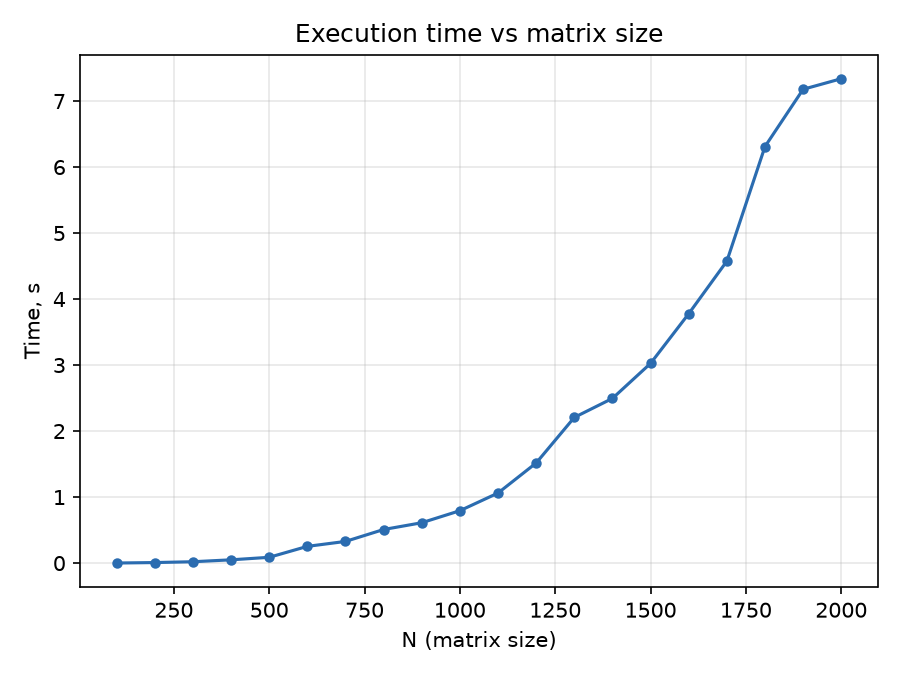
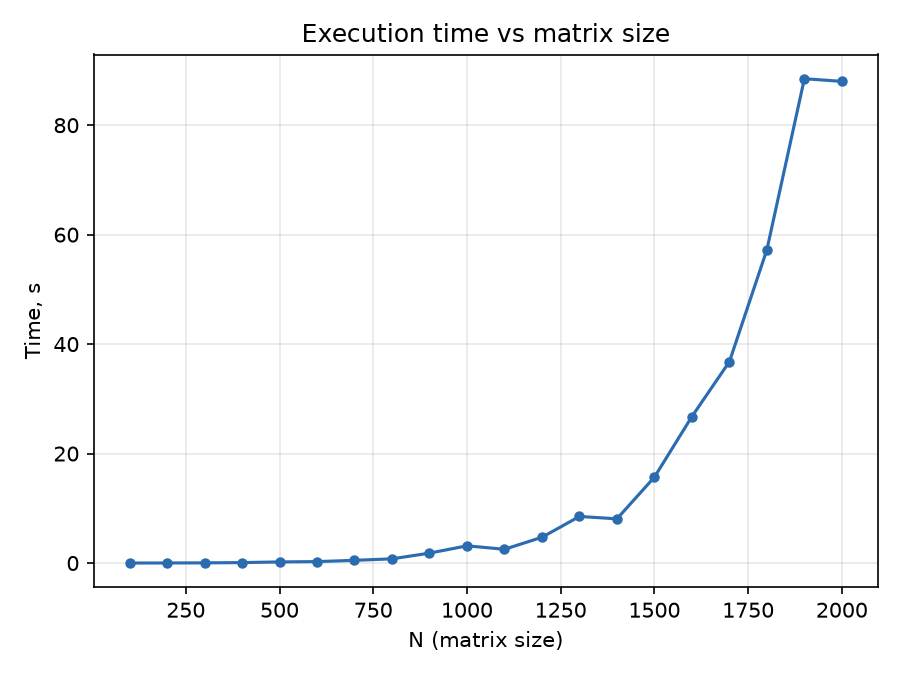

# Lab 1


## Task description

Написать программу на языке C/C++ для перемножения двух квадратных матриц.

## Files

`matmul.c` - умножение матриц  
`Makefile` - сборка  
`gen_matrix.py` - генерация случайных матриц  
`verify.py` - верификация результата через NumPy  
`experiments.py` - серия экспериментов + график  
`run.sh <n>` - все разом, n - размер матрицы  

## Device

CPU: Intel(R) Core(TM) i5-8265U @ 1.60GHz, 4 core 8 threads

## Results `multiply_fast`

Файл `matmul.c`, функция `multiply_fast`

`time` = замер clock_gettime вокруг цикла умножения  
`GFLOPS` = 2·N^3 / `time` / 1e9  
`mem` = 3 · N^2 · sizeof(double)  
`verify` = сравнение с NumPy (`A @ B`)  

| `N` | `time, s` | `GFLOPS` | `mem, mb` | `verify` |
| - | - | - | - | - |
| 100 | 0.0009 | 2.29 | 0.23 | PASS |
| 200 | 0.0080 | 2.00 | 0.92 | PASS |
| 300 | 0.0205 | 2.64 | 2.06 | PASS |
| 400 | 0.0494 | 2.59 | 3.66 | PASS |
| 500 | 0.0876 | 2.85 | 5.72 | PASS |
| 600 | 0.2534 | 1.71 | 8.24 | PASS |
| 700 | 0.3281 | 2.09 | 11.22 | PASS |
| 800 | 0.5087 | 2.01 | 14.65 | PASS |
| 900 | 0.6113 | 2.39 | 18.54 | PASS |
| 1000 | 0.7935 | 2.52 | 22.89 | PASS |
| 1100 | 1.0615 | 2.51 | 27.69 | PASS |
| 1200 | 1.5166 | 2.28 | 32.96 | PASS |
| 1300 | 2.2068 | 1.99 | 38.68 | PASS |
| 1400 | 2.4950 | 2.20 | 44.86 | PASS |
| 1500 | 3.0257 | 2.23 | 51.50 | PASS |
| 1600 | 3.7780 | 2.17 | 58.59 | PASS |
| 1700 | 4.5744 | 2.15 | 66.15 | PASS |
| 1800 | 6.3107 | 1.85 | 74.16 | PASS |
| 1900 | 7.1783 | 1.91 | 82.63 | PASS |
| 2000 | 7.3384 | 2.18 | 91.55 | PASS |



## Results `multiply_naive`

Файл `matmul.c`, функция `multiply_naive`

| `N` | `time, s` | `GFLOPS` | `mem, mb` | `verify` |
| - | - | - | - | - |
| 100 | 0.0011 | 1.81 | 0.23 | PASS |
| 200 | 0.0099 | 1.62 | 0.92 | PASS |
| 300 | 0.0303 | 1.78 | 2.06 | PASS |
| 400 | 0.0790 | 1.62 | 3.66 | PASS |
| 500 | 0.2015 | 1.24 | 5.72 | PASS |
| 600 | 0.2605 | 1.66 | 8.24 | PASS |
| 700 | 0.4938 | 1.39 | 11.22 | PASS |
| 800 | 0.7662 | 1.34 | 14.65 | PASS |
| 900 | 1.8078 | 0.81 | 18.54 | PASS |
| 1000 | 3.1444 | 0.64 | 22.89 | PASS |
| 1100 | 2.5123 | 1.06 | 27.69 | PASS |
| 1200 | 4.6998 | 0.74 | 32.96 | PASS |
| 1300 | 8.5106 | 0.52 | 38.68 | PASS |
| 1400 | 8.0770 | 0.68 | 44.86 | PASS |
| 1500 | 15.6892 | 0.43 | 51.50 | PASS |
| 1600 | 26.7625 | 0.31 | 58.59 | PASS |
| 1700 | 36.7881 | 0.27 | 66.15 | PASS |
| 1800 | 57.2446 | 0.20 | 74.16 | PASS |
| 1900 | 88.4881 | 0.16 | 82.63 | PASS |
| 2000 | 88.0041 | 0.18 | 91.55 | PASS |



## Summary

С ростом N время выполнения растет нелинейно, что ожидаемо для алгоритма сложностью O(N^3). Оценка показателя степени по данным таблицы (log-log регрессия, N от 300): `multiply_fast` ~3.1, `multiply_naive` ~4.3 - у оптимизированной версии показатель близок к теоретическим 3, у наивной - заметно хуже.

При N=2000 наивный цикл в ~12 раз медленнее (88с против 7.3с), хотя число операций одинаковое - разница только в порядке обращения к памяти. С ростом N рабочие данные перестают помещаться в L1/L2, и доля промахов кэша растет вместе с N - поэтому показатель степени у наивной версии хуже теоретического.

Наивный порядок циклов i-j-k:
```c
for (i)
  for (j)
    for (k)                       // внутренний цикл
      sum += a[i*n+k] * b[k*n+j]; // b читается по столбцу, шаг n - почти каждое обращение мимо кэша
```

Оптимизированный порядок i-k-j:
```c
for (i)
  for (k)
    r = a[i*n+k];
    for (j)                       // внутренний цикл
      c[i*n+j] += r * b[k*n+j];   // b и c читаются подряд - кэш-линия используется вся
```

Последовательный доступ во внутреннем цикле также дает компилятору автовекторизовать его (SIMD) - при доступе с шагом n это невозможно.
